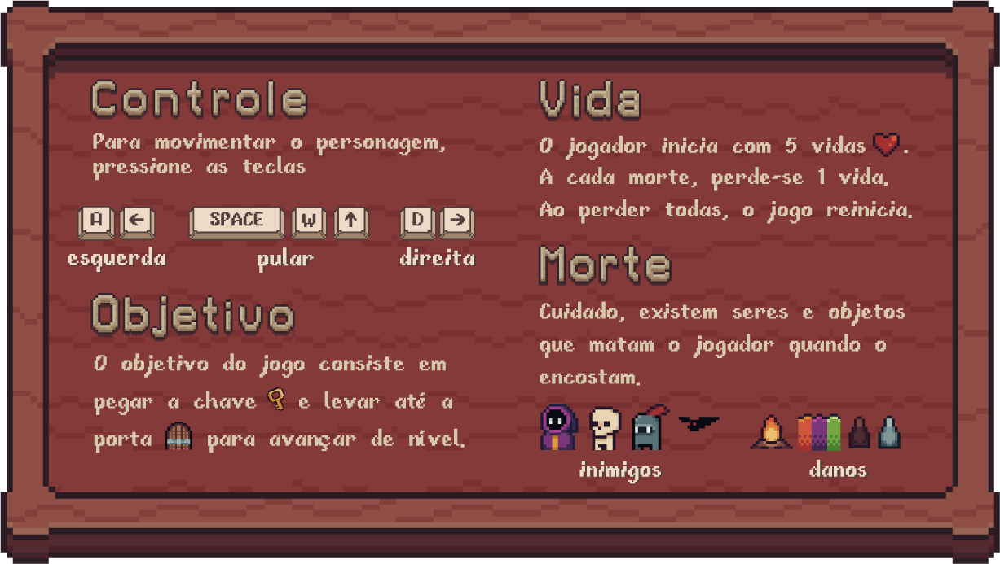

[](https://classroom.github.com/a/Tw1jAWFH)
# Modelo para o Trabalho Final de POO-II
Esse modelo contém uma estrutura pronta para entrega de todas as etapas do Trabalho Final (TF) de POO-II.

Os alunos deverão desenvolver um jogo interativo e com interface gráfica utilizando todos os conceitos estudados no decorrer da disciplina.

O TF é desenvolvido ao longo do semestre e terá 3 entregas. Cada entrega possui um diretório no repositório:
 - Diagrama UML das classes
 - Projeto de interface gráfica, contendo telas de início e fim, menus, bem como da view principal do jogo
 - Protótipo do jogo com mecanismos principais implementados
 - Versão final para entrega, contendo relatório, códigos/diagramas e um vídeo explicando o projeto.

Os grupos serão avaliados de forma objetiva (aplicação de conceitos, entregas no prazo, etc) e também subjetiva (qualidade e eficiência do código, trabalho em equipe, etc).

Aqui vai um exemplo de TODO list contendo as etapas.
- [x] Descrição do jogo
- [x] Diagramas UML
- [x] Interface Gráfica 
- [x] Protótipo do jogo 
- [x] Versão final com relatório e vídeo 


---
# Jogo - The Lost Key
## Sobre o Jogo
The Lost Key é um jogo de plataforma criado com Pygame para a disciplina de Programação Orientada a Objetos II - UFSC 2023.2. Mais informações sobre o jogo e como jogar na imagem abaixo.

<div align="center">
    
</div>

## Como instalar e rodar o jogo

Para executar o jogo, é necessário que o usuário tenha Python instalado na máquina e as dependências (pygame e pytmx).
Com o python instalado, vá ao terminal do computador aberto na pasta do jogo e escreva:
  
### Mac e Linux

```sh
pip3 install -r requirements.txt
```
```sh
python3 main.py
```
### Windows
```sh
pip install -r requirements.txt
```
```sh
python main.py
```
